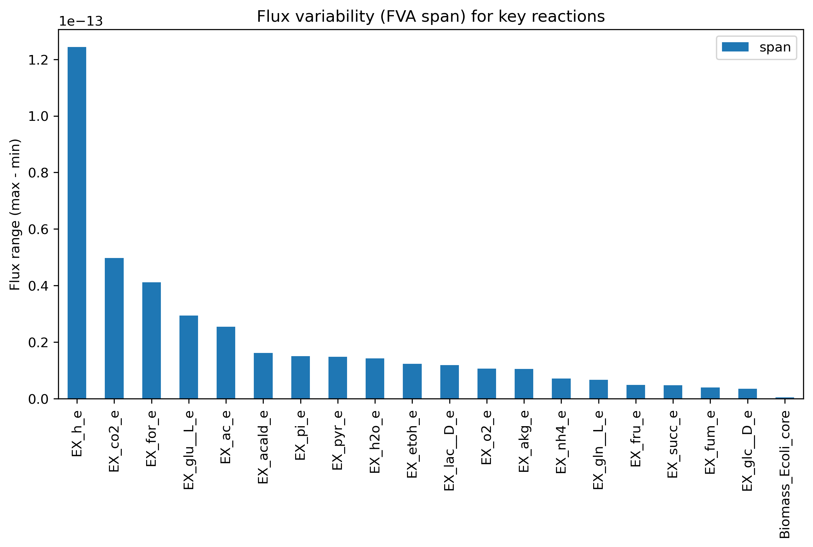
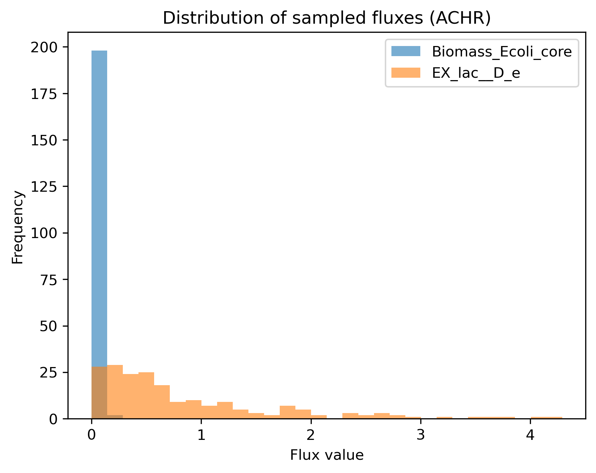
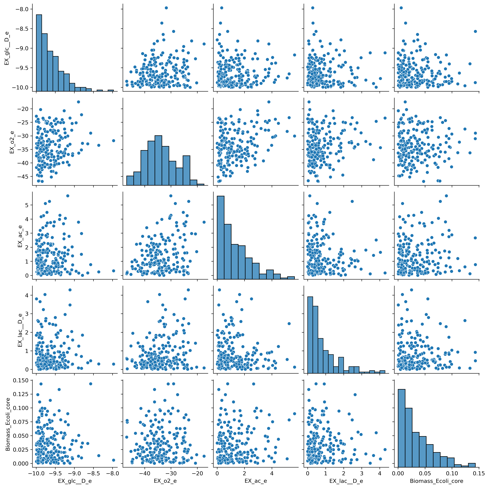

This repository contains my implementation of Flux Balance Analysis (FBA) on the E. coli core model using COBRApy, including visualization and sampling analysis.

🧬 Flux Balance Analysis of E. coli Core Model

This project explores the core metabolic network of E. coli using COBRApy to perform Flux Balance Analysis (FBA), Flux Variability Analysis (FVA), and flux space sampling (ACHR).
The notebook was designed to both reproduce key concepts from constraint-based modeling and serve as a hands-on, visual example of data-driven metabolic analysis.

Introduction

The E. coli core model (also known as the “textbook model”) is a simplified but biologically accurate reconstruction of central metabolism, including glycolysis, the TCA cycle, and key exchange reactions.
The goal of this project was to:
	1.	Load and inspect the metabolic model.
	2.	Perform optimization to estimate growth rate under different environmental conditions.
	3.	Explore pathway flexibility with FVA.
	4.	Analyze flux variability through ACHR sampling and visualize distributions.

 Methods Overview
	•	Language / Tools: Python (Jupyter Notebook), COBRApy, pandas, matplotlib, seaborn, scikit-learn.
	•	Model: e_coli_core.json (loaded through COBRApy’s load_model("textbook"))
	•	Optimization solver: GLPK backend.
	•	Sampling method: ACHR (Artificial Centering Hit-and-Run).

Steps
	1.	Verified COBRApy installation and solver configuration.
	2.	Loaded E. coli core model and checked its size (95 reactions, 72 metabolites, 137 genes).
	3.	Ran FBA to determine the optimal growth rate.
	4.	Limited glucose and oxygen uptake to simulate aerobic and anaerobic conditions.
	5.	Performed reaction knockout experiments (e.g., PFK).
	6.	Conducted FVA to measure pathway flexibility.
	7.	Sampled 200 feasible flux distributions using ACHR.
	8.	Visualized and interpreted results with histograms, scatter plots, PCA, and pairplots.

Results & Visualization

1. Flux Variability Analysis (FVA)

The FVA bar plot shows how much each key reaction can vary while maintaining the same optimal growth.
Reactions like EX_h_e, EX_co2_e, and EX_for_e show a wider flux range, indicating flexibility and alternative routes for metabolite exchange.
In contrast, EX_glc__D_e, EX_o2_e, and Biomass_Ecoli_core have nearly zero span, meaning they are tightly constrained and essential for growth.

Interpretation:
Essential pathways remain fixed under optimal growth, while exchange reactions involving by-products like formate, acetate, or hydrogen exhibit metabolic flexibility.

2. Distribution of Sampled Fluxes (ACHR)

The histogram displays the distribution of two important fluxes: Biomass_Ecoli_core (growth rate) and EX_lac__D_e (lactate secretion).
Biomass fluxes are tightly centered around a single peak, showing stable growth behavior across all feasible states.
In contrast, lactate fluxes have a broader spread, reflecting that lactate secretion can vary substantially while still sustaining growth.

Interpretation:
The model maintains a consistent growth rate, but the route of energy metabolism (fermentation vs. respiration) can change — a hallmark of E. coli’s metabolic adaptability.

3. Relationship Between Lactate Secretion and Growth

This scatter plot compares EX_lac__D_e and Biomass_Ecoli_core.
There is a weak negative trend: higher lactate secretion generally corresponds to slightly lower growth rates.

Interpretation:
When oxygen availability is limited, E. coli shifts toward fermentation, producing lactate but achieving lower biomass yields — consistent with biological reality.

4. Principal Component Analysis (PCA)

The PCA scatter plot summarizes the 200 sampled flux states into two dimensions (PC1 and PC2).
The broad spread of points along PC1 indicates high variability among feasible metabolic states, while PC2 captures smaller fluctuations.

Interpretation:
The flux space of E. coli is high-dimensional but structured: even within feasible solutions, some directions (metabolic modes) dominate variability — showing the balance between flexibility and constraint in the network.

Discussion

Overall, these analyses reveal the robustness of E. coli’s metabolism:
	•	Growth remains highly stable under a wide range of flux configurations.
	•	A small subset of exchange reactions (e.g., CO₂, H₂, formate) accounts for most variability.
	•	Anaerobic and aerobic modes naturally emerge as alternative metabolic strategies.

This project demonstrates how constraint-based modeling and simple data visualization can give real insight into biological systems, bridging biology, optimization, and data science.

References
	•	Orth JD, Thiele I, Palsson BØ. “What is flux balance analysis?” Nature Biotechnology (2010).
	•	COBRApy Documentation: https://cobrapy.readthedocs.io
	•	Schellenberger et al. “Quantitative prediction of cellular metabolism with constraint-based models.” Biotechnology Journal (2011).

Author

Project by Samira Sadeghi
